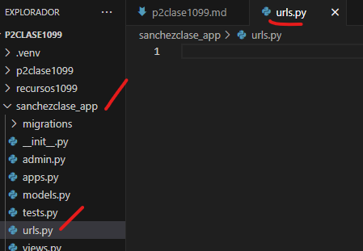
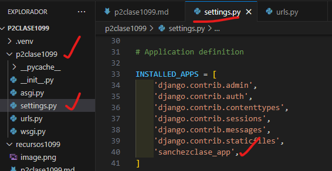
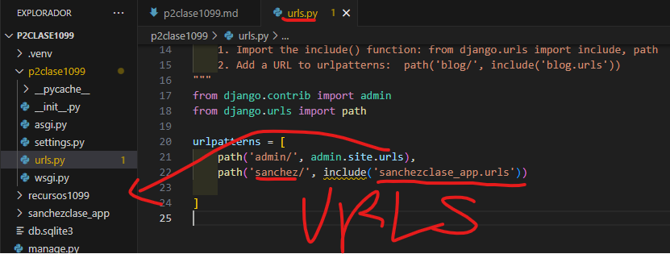
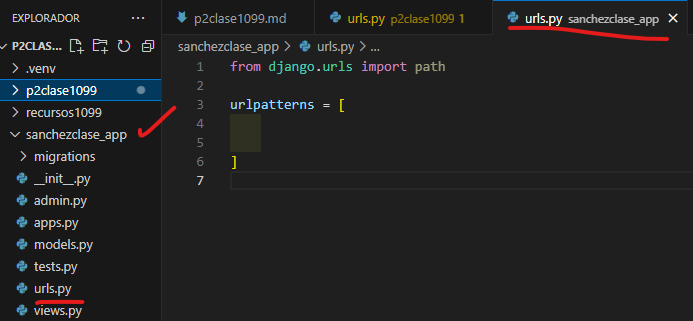
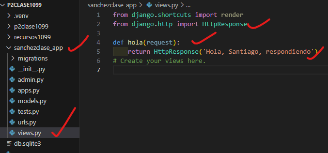
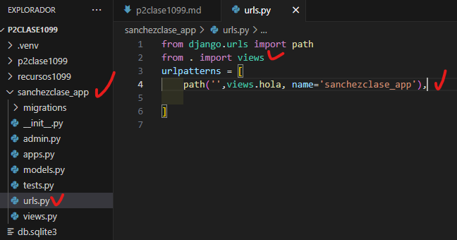

- Crear aplicacion sanchezclase_app
- Comando --> python manage.py startapp sanchezclase_app
- Creamos el archivo urls.py en sanchezclase_app
- 
- En setting.py de p2clase1099
- 
- En urls.py de p2clase1099
- 
- En urls.py en sanchezclase_app
- 
- En views.py en sanchezclase_app
- 
- En urls.py en sanchezclase_app
- 
- 